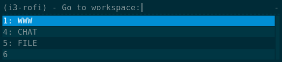

Introduction
============

**i3-rofi** provides a useful set of menus based on `Rofi
<https://davedavenport.github.io/rofi>`_ to interact with `i3wm
<http://i3wm.org>`_.

Installation
============
::

    $ sudo pip install i3-rofi

Usage
=====
You can use i3-rofi directly from the command line::

    $ i3-rofi --help

or::

    $ i3-rofi -m go_to_workspace

You can add i3-rofi to your i3 config. For example::

    bindsym $mod+w exec --no-startup-id i3-rofi --menu=go_to_workspace

or::

    bindsym $mod+w exec --no-startup-id i3-rofi -m go_to_workspace

Menus
=====
The complete list of menus includes:

go_to_workspace
----------------

move_window_to_workspace
------------------------
...

move_window_to_this_workspace
-----------------------------
...

move_workspace_to_output
------------------------
...

rename_workspace
----------------
...

window_actions
--------------
...

workspace_actions
-----------------
...
